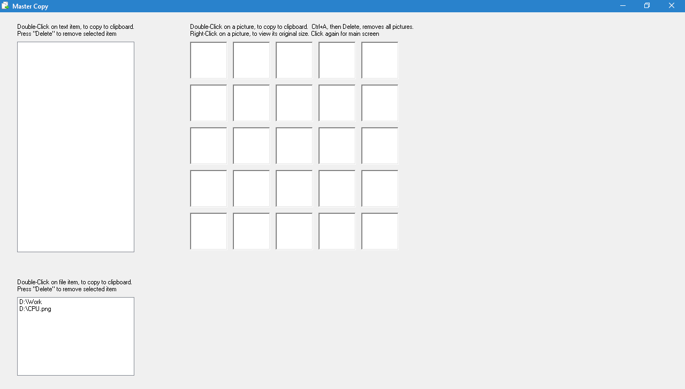

**Master Copy**

**Manages multiple clipboard objects**

The main idea behind this utility was to save bugs content, along with their

IDs, full text descriptions and screenshots.

For that, I had to have a utility, which will combine multiple types of
clipboard objects: text, images and files.

After launching the application, the main screen looks like that:

Now, we can:

-   **Copy text**: select a single line, or multiple lines and copy to
    clipboard-\>

the copied text will be added to the text region (upper-left part), line by
line.

-   Double-click on a text line (from the added lines)-\> This selects the line
    and copies it to the clipboard. Now, we can paste it to a code editor.

-   Select one or more of the text lines (from the added lines), by highlighting
    them, then press Delete/Del key-\> The selected text lines will be removed.

-   **Copy images:** Press the PrintScreen keyboard key (or Alt+PrintScreen
    key),

to create a screenshot-\> the copied picture will be added to the pictures
region (upper-right part).

-   Double-click on a picture-\> This selects the picture and copies it to the
    clipboard. Now, we can paste it to a photo editor (such as Paintbrush).

-   Right-click on a picture-\> The selected picture will be shown in its
    original size. Click again-\> we are back in the application's main screen.

-   **Copy files:** We can also copy & paste files and directories, in a similar
    way we do with copying text or images. The built-in app instructions will
    help us

do that.

**Code location:**
<https://github.com/LiorBob/MasterCopy/blob/master/MasterCopy/frmMasterCopy.cs>
